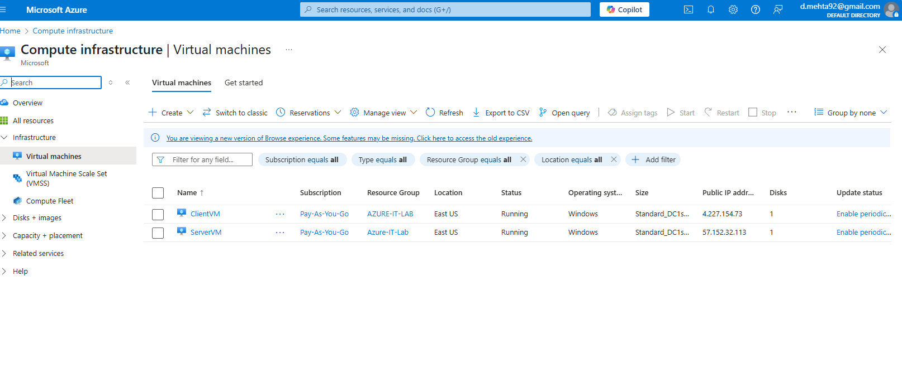
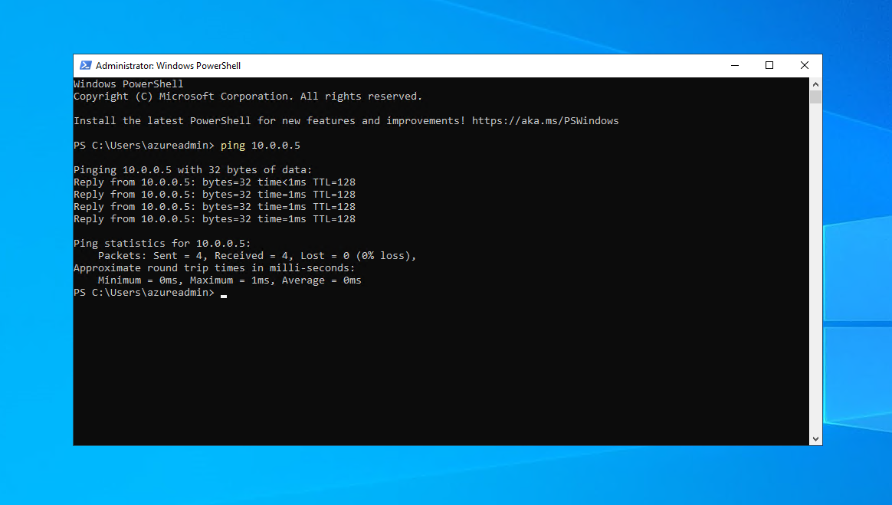
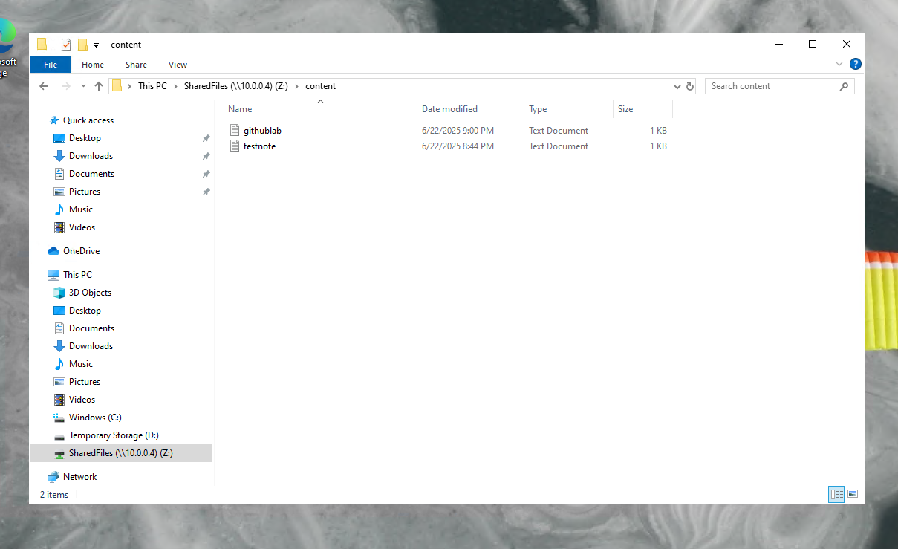
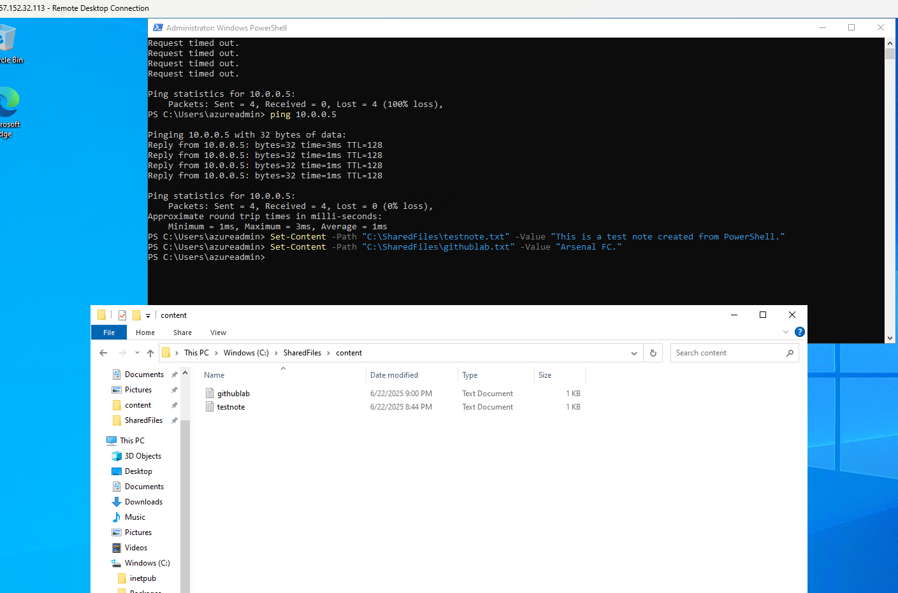

Azure IT Support Lab  
---

Project Summary  
---

This project simulates a real-world IT support environment using Microsoft Azure. I built a virtual lab with two virtual machines on the same virtual network, configured internal communication, set up secure file sharing using SMB, and used PowerShell to automate file creation. The goal was to practice core Azure services and demonstrate basic IT infrastructure skills from scratch.

**Languages Used**  
- PowerShell

**Environments Used**  
- Microsoft Azure  
- Windows Server 2022  
- Windows 10 Pro

**Technologies / Services Used**  
- Azure Virtual Machines  
- Azure Virtual Network (VNet / Subnet)  
- Remote Desktop Protocol (RDP)  
- SMB Shared Folder  
- PowerShell scripting

---

Media (Screenshots)  
---

| Screenshot | Description |
|------------|-------------|
|  | Project overview architecture diagram |
|  | Azure portal showing both VMs running |
|  | Successful ping test from ServerVM to ClientVM |
|  | Shared folder configured on ServerVM |
|  | ClientVM mapping the shared folder as the Z: drive |
|  | PowerShell commands creating .txt files in the share |

---

Demonstration  
---

1. **Resource Setup**  
Created a resource group in Azure named `Azure-IT-Lab` and a virtual network (`IT-VNet`) with subnet `10.0.0.0/24`.

2. **VM Deployment**  
Deployed:
- ServerVM: Windows Server 2022, IP `10.0.0.4`, RDP enabled  
- ClientVM: Windows 10 Pro, IP `10.0.0.5`, RDP enabled

3. **Network Configuration & Connectivity**  
Configured Network Security Group (NSG) to allow ICMP (ping).  
Verified internal connectivity using `Test-Connection` in PowerShell from ServerVM to ClientVM.

4. **File Sharing Configuration**  
Created folder `C:\SharedFiles\content` on ServerVM.  
Shared it with **Everyone (read/write)**.  
Mapped the folder as a network drive (Z:) on ClientVM using UNC path:  
`\\10.0.0.4\SharedFiles`.

5. **PowerShell Scripting**  
Used PowerShell on ServerVM to create text files in the shared folder:
```powershell
Set-Content -Path "C:\SharedFiles\testnote.txt" -Value "This is a test note created from PowerShell."
Set-Content -Path "C:\SharedFiles\githublab.txt" -Value "Arsenal FC."
```

6. **Testing**  
On ClientVM, verified the Z: drive was mapped and accessible.  
Confirmed read/write functionality by opening the text files created on ServerVM.  
File sharing and permissions worked correctly, and the mapped drive persisted across sessions.

